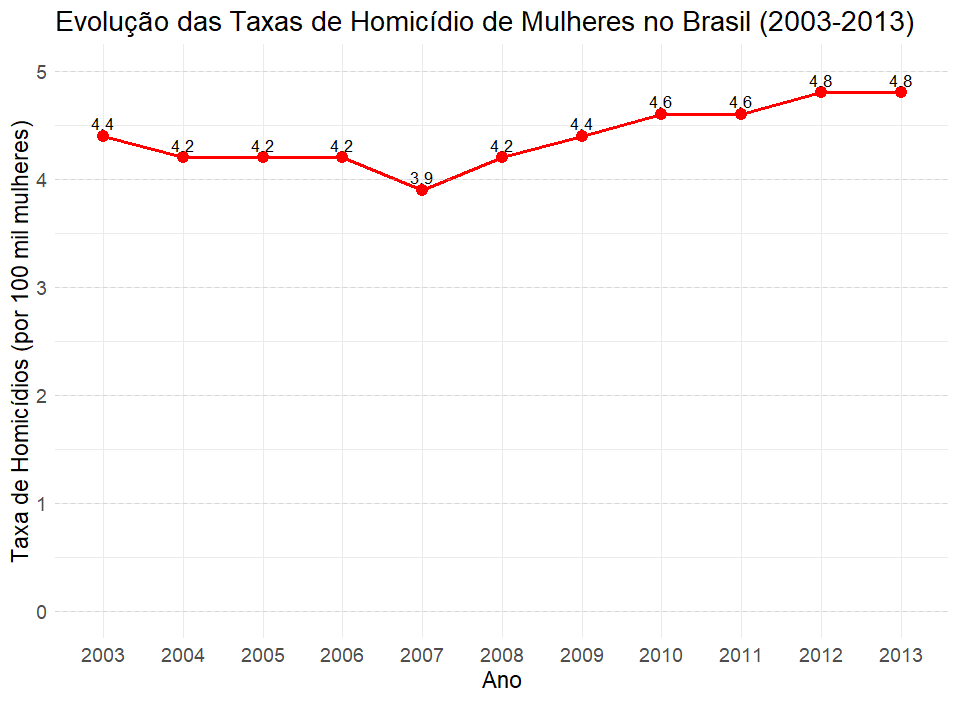

# Desafio-01-Ara

---
title: "Desafio 01"
author: "Gabriela Jungblut, Júlia Zorzo e Manuella Kauany"
date: "2024-09-24"
output: html_document
---

## Exemplos de Gráficos Errados ou Inefetivos

### Exemplo 1

{width="541"}

[G1.Globo](https://g1.globo.com/politica/noticia/2015/11/503-dos-homicidios-de-mulheres-no-brasil-sao-cometidos-por-familiares.html)

 
Segue trechos da matéria para que seja amelhor o entendimento do que está sendo apresentado no gráfico: 

"Entre 2003 e 2013, o número de homicídios de mulheres passou de 3.937 para 4.762, aumento de 21% no período. As 4.762 mortes em 2013, último ano do estudo, representam uma média de 13 mulheres assassinadas por dia."
"Levando em consideração o crescimento da população feminina entre 2003 e 2013 (passou de 89,8 milhões para 99,8 milhões), a taxa de homicídio de mulheres saltou de 4,4% em 2003 para 4,8% em 2013, aumento de 8,8% no período."
Para melhor entendimento, entrar no link abaixo do gráfico. 

O gráfico apresenta algumas ausências que dificultam a interpretação imediata e precisa dos dados. Primeiramente, ele se refere ao Brasil, no entanto, essa informação não está claramente indicada no título, sendo recomendável incluir essa referência para garantir uma melhor compreensão. Além disso, o gráfico carece de legendas claras e definição dos eixos. No eixo Y (vertical), as taxas de homicídio estão representadas por números em vermelho, mas não há indicação explícita de que esses números correspondem a 'homicídios por 100 mil mulheres'. O eixo X (horizontal) parece indicar os anos, mas também poderia ser mais explicitamente rotulado. 

Mesmo com o aumento nas taxas de homicídios de mulheres, como o crescimento de 8,8% de 2003 a 2013, a falta de ajuste adequado da escala faz com que as mudanças pareçam pequenas. Caso a escala fosse expandida, por exemplo, começando em 0 as variações anuais seriam mais evidentes, proporcionando uma percepção mais clara do aumento ao longo do tempo e destacando melhor a gravidade do problema.novo

Segue novo gráfico readequado:

### Exemplo 2

  Este gráfico tem como intenção mostrar a **centralização da posse mundial da criptomoeda Bitcoin** com base em dados de setembro de 2017. 
  
  Para saber que as informações se referem à **posse de Bitcoin no mundo**, é necessário acessar o site howmuch.net e ler o artigo em que o gráfico está inserido, pois ele próprio **não traz essa informação**, o que, por sua vez, já faz dele inefetivo. 
  
  A sua característica mais gritante é a **divisão escolhida**. Se aproximando mais de um gráfico de setores, cada fatia não se assemelha a um setor circular, e sim a formas aleatórias, dificultando a mensuração exata das porcentagens e a visualização de dados em geral, o que possivelmente representa o **maior problema do gráfico**. 
  
  O que tenta ser informado em cada porção é a "x porcentagem de Bitcoin pertencente à y porcentagem de endereços'. Na fatia azul escura do topo, por exemplo, 17.49% de Bitcoin pertence à 0.00088% dos endereços (localizações/identificadores virtuais), o que mostra ao leitor que uma boa parte do bitcoin pertence a uma pequena parte de identificadores, evidenciando essa centralização que se deseja mostrar. Porém um possível problema é a sua escrita. Usando o mesmo exemplo, o que se traduz do inglês é "0.00088% dos endereços possuem 17.49% do Bitcoin", a ordem inversa do frase citada acima. Mesmo mantendo o significado na ordem trocada, a questão está no fato de que as fatias do gráficos mostram a porcentagem de Bitcoin, informação que vem em segundo lugar na frase. Essa escolha pode **induzir o leitor a pensar que os "setores" do gráfico indicam a porcentagem de endereço**, já que é a informação apresentada primeiro. Apesar de estar claro a distribuição do Bitcoin no título e não fazer sentido uma fatia grande representar uma pequena porcentagem ou uma fatia pequena representar uma grande porcentagem, é **tanta informação distribuída e inefetiva**, que esse desvio pode acontecer de forma sutil e **impedir o leitor de compreender o gráfico**.
  
  Em relação às cores, grande parte do gráfico está em tons de azul para representar as grandes porcentagens de bitcoin pertencentes às pequenas porcentagens de endereços. O contrário ocorre na parte inferior dele com os tons de rosa. Apesar de **não complementares**, que seria o ideal para mostrar o contraste na distribuição desigual do bitcoin, as cores escolhidas provocam uma significativa diferenciação visual, porém a fatia referente à "0.00000748% dos endereços têm posse de 0,73% de BTC", na parte inferior do gráfico, tem o tom azul mais escuro e está colocada ao lado das fatias com os tons mais claros de azul, e ainda fica ao lado das fatias cor de rosa, **sem motivo aparente**. Em um primeiro momento ela poderia ser interpretada como um tom de roxo próximo aos tons de rosa que vão escurecendo em sua direção. 
  
  Por fim, a **informação mais importante do gráfico**, a **junção das porcentagens das partes azuis e a das partes em rosa**, escritas em cima e embaixo dos "setores", tem como únicos destaques o tamanho da fonte, o uso da caixa alta e duas flechas que poluem ainda mais a imagem. Muito possivelmente, **o leitor disposto a ler o gráfico todo fique um tempo lendo as porcentagens individuais e depois perceba as informações conjuntas indicadas pelas flechas**, sendo que tudo poderia ser mais simplificado por meio de um gráfico mais efetivo como mostrado a seguir: 
  
  
  

<!-- 
Referências: https://howmuch.net/articles/bitcoin-wealth-distribution e https://getdolphins.com/blog/the-worst-graphs-of-2017/ -->

